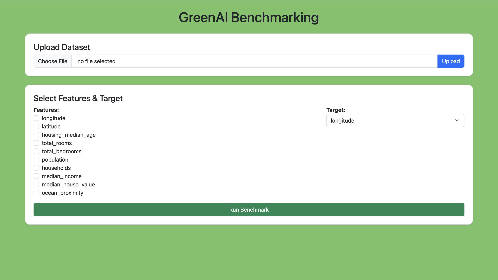
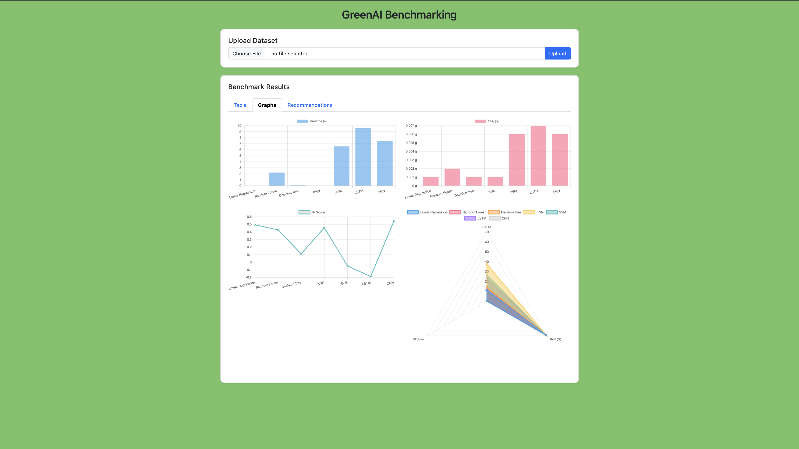
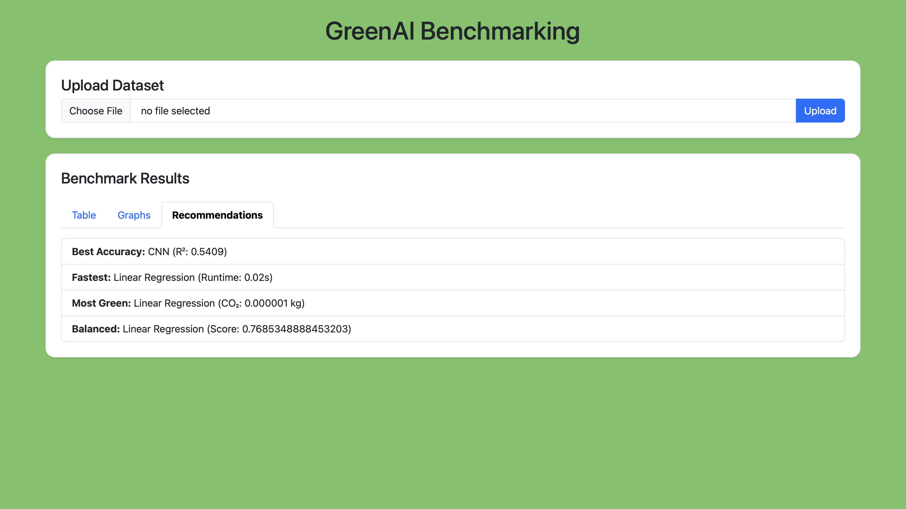

# GreenAI-Benchmarking-Tool
This project will be a valuable input in the field of green AI, since there are multiple studies stating the urgent need for energy efficient AI along with edge computing, to scale AI models to consume less energy, resulting in reduced carbon footprint. 
We will be using CodeCarbon for initial testing of this system.
**Tools used:**
1. EmissionTracker
2. track_emissions
Installation Process:
**Mac:**

**If in conda environment:**
```bash
conda create --name codecarbon
conda activate codecarbon
```
**PIP method:** 
```bash
pip install codecarbon
```
**Conda Repository:**
```bash
conda install -c codecarbon -c conda-forge codecarbon
```
**Dataset Uploading Page**

**Benchmarking Results**

**Reccomendation Page**



